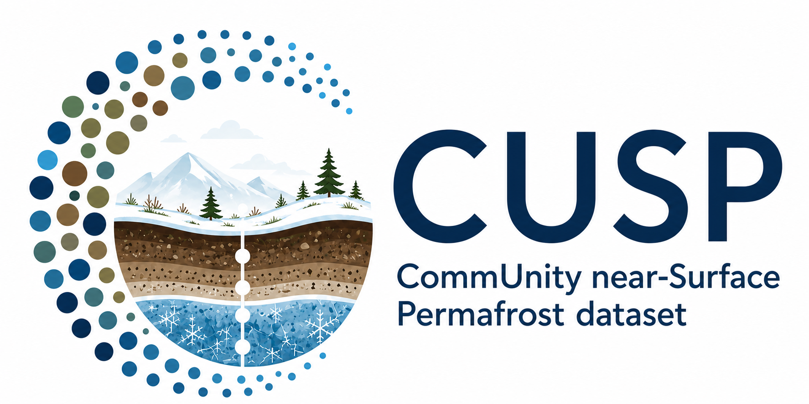

  

# CommUnity near-Surface Permafrost (CUSP)

CUSP is a synthesis of near-surface permafrost observations from published
sources, research groups, collaborators, and our own field work.

See the [CUSP documentation](https://jonschwenk.github.io/cusp/) to download,
understand, cite, rebuild, or extend the dataset.

## Current Data Release

<!-- CUSP_DATA_TRACKER:START -->
<table>
  <tr>
    <td align="center" width="33%"><strong><a href="https://github.com/jonschwenk/cusp/releases/tag/v1.1">v1.1</a></strong> Latest release</td>
    <td align="center" width="33%"><strong>79,389</strong> Total observations</td>
    <td align="center" width="33%"><strong>57</strong> Included sources</td>
  </tr>
  <tr>
    <td align="center"><strong>62,135</strong> Permafrost presence</td>
    <td align="center"><strong>17,254</strong> Permafrost absence</td>
    <td align="center"><strong>59,051</strong> ALT / thaw-depth measurements</td>
  </tr>
</table>

ALT / thaw-depth measurements also carry a permafrost state, so this count overlaps the presence/absence counts.

<!-- CUSP_DATA_TRACKER:END -->

## Contributing

[Suggest or add data to CUSP](https://jonschwenk.github.io/cusp/contributing/suggest-dataset/).
A public link is enough to get started; for unpublished data, contact
[cusp.data@gmail.com](mailto:cusp.data@gmail.com).

## License

See the [license](LICENSE.txt).
